# qa-project

### Table of Contents
- [Brief](#brief)
- [Architecture](#architecture)
	- [Database Structure](#database-structure)
	- [Continuoue Integration Pipeline](#continuoue-integration-pipeline)
- [Project Tracking](#project-tracking)
- [Risk Assessment](#risk-assessment)
- [Testing](#testing)
- [Fron End](#front-end)
- [Known Issues](#known-issues)
- [Further Improvements](#further-improvements)
- [Author](#author)

# Brief
My objective for this project was to create an application that exercises CRUD (Create Read Update and Delete) functionalities whilst making use of the technologies and the training I've learnt in the past six weeks.

The requirements are as followed:

	• A project tracking software (Trello Board)
	• A Relational database used to store data persistently for the project(2 or more tables)
	• Clear Documentation of my design phase that describes the architecture that'll be used for the project and also a detailed Risk assessment
	• A functioning front-end web application that 
	• A functioning CRUD application that has been created by python using 

To achieve this I decided to create a car reviews app, where users can put up their vehicle and the public can see the cars and review them:

I started by creating a Cars table where users will be able to store details of their vehicles, this table will contain 
	
	• Car_id
	• Reg
	• Make
	• Model
	• millage 
	• Colour
	• Age

My second table will be the Reviews table which will store the reviews on a car, this table will contain 
	
	•Reviews_id
	• Name
	• Review
	• Rating
	• Review Date
	• Car_ID

By allowing car owners to add cars to the DB that will be me showing 'Create' from the CRUD specification

By allowing users to view cars that the owners have put up, then I will be able to justify the 'Read' aspect of CRUD.
By allowing car owners to edit the details of their cars and by giving them the ability to delete a car, I will be able to justify the 'Update' and 'Delete' in CRUD.

# Architecture
### Database Structure

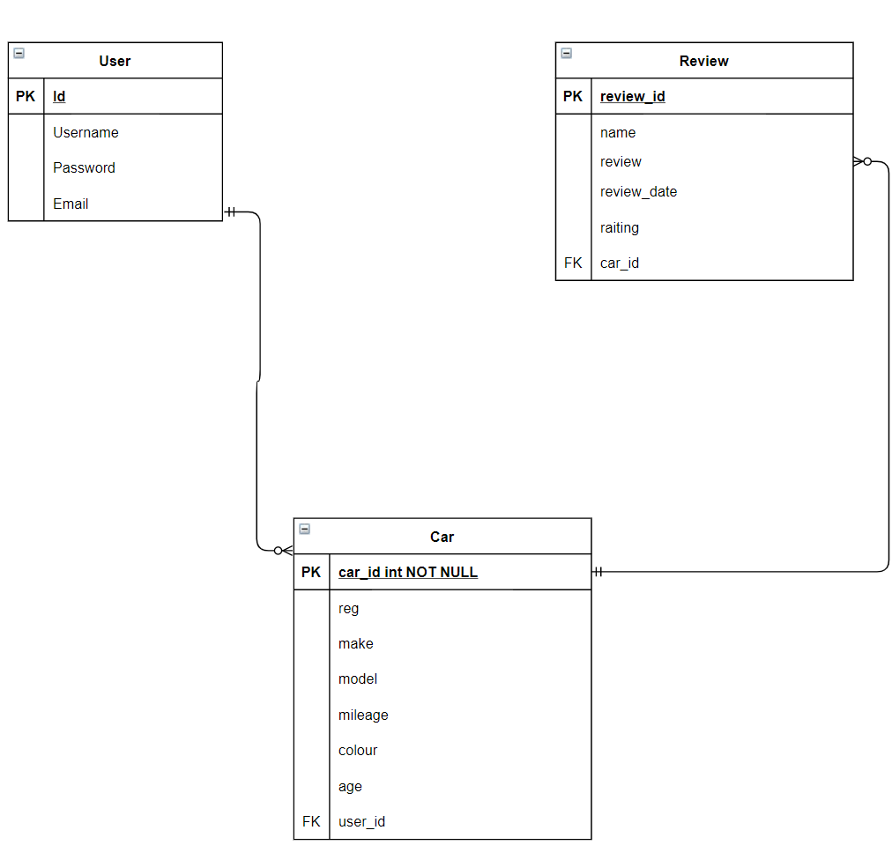

This picture above shows my first attempt for the ERD table design for this project, the below picture shows my finished product of the ERD table. My database design has a One to Many relationship between Cars and Reviews, which allows multiple reviews on one car.

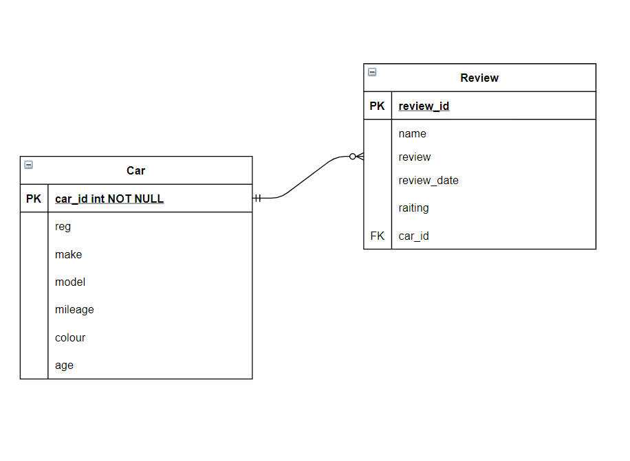

### Continuoue Integration Pipeline

The picture below shows my CI Pipeline. 

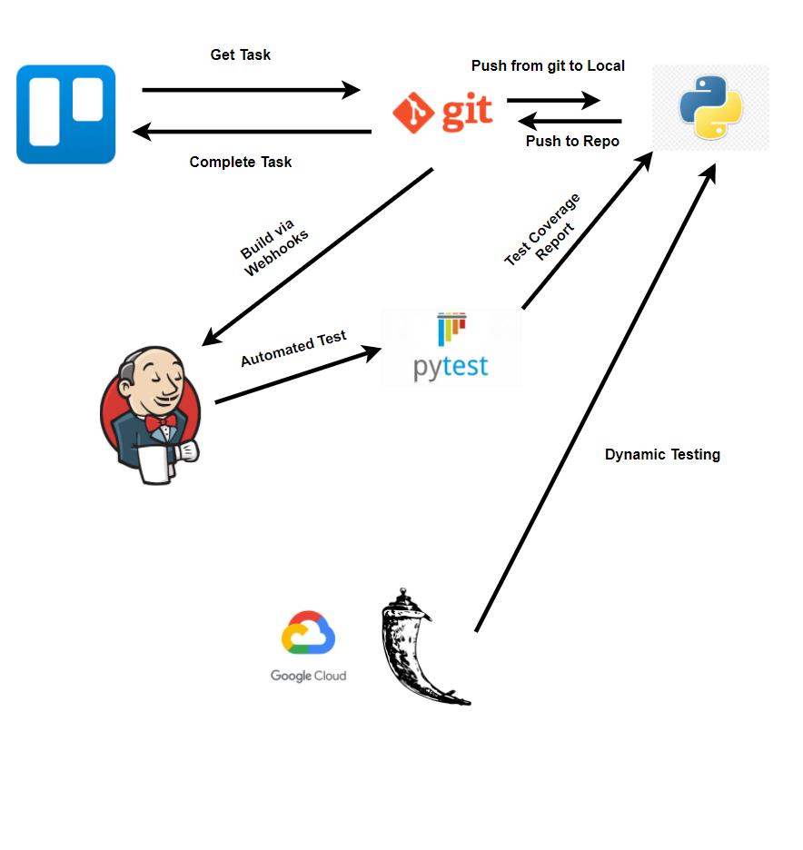

# Project Tracking

I used Trello to track the progress of the project 
Here's a link to my board.
https://trello.com/b/m2DuZPr2/abarimotors

Here's a screenshot to show my Kanban board

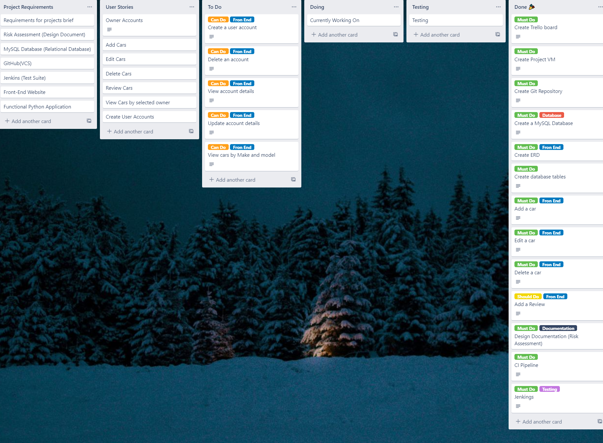

This board has been designed in a way that when a task is added it is placed on the far left hand side and as the task gets completed it moves to the right hand side.

A list of the headings are
Project Requirements
User Stories
To Do
Doing
Testing
Done

# Risk Assessment

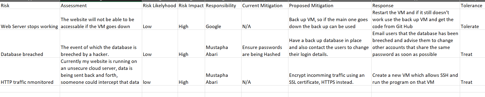

The picture above shows the first draft of my risk asssessment, the picture below shows the final draft of my risk assessment, as i went along the project i was able to spot risk that i couldnt see at the start of the project

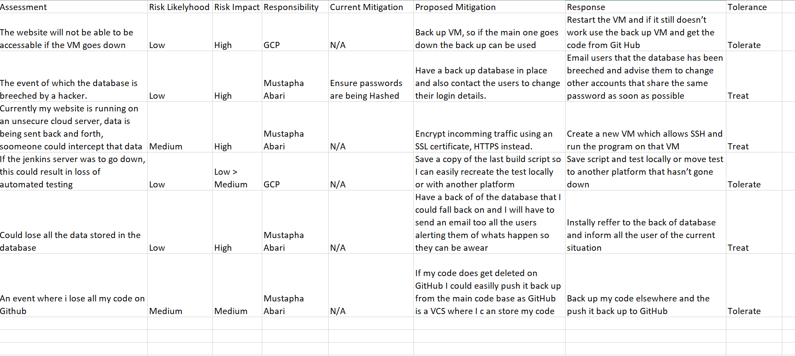

# Testing

I have used pytest to run test on my website.
I used Jenkins to perform an automated test
I connected it to GitHub via Webhooks so whenever I push my code to GitHub my test is run automatically

Below is an image of Jenkins running pytest automatically

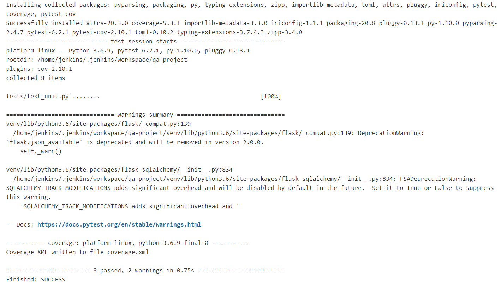

I also ran test manually so i could see the coverage report on my code
Here is a screenshot below of my coverage

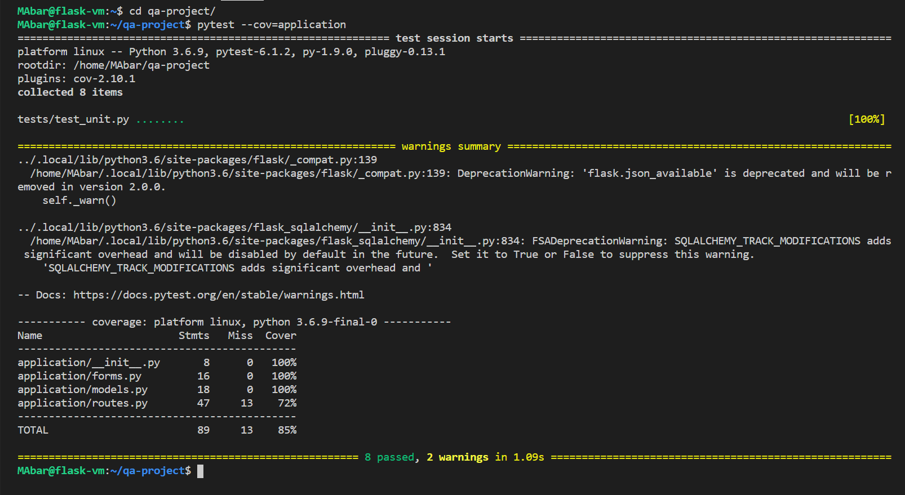

# Front-end
This is the front end design of my website, it is a very basic HTML build with no styling

Home Page
This is the read functionality in CRUD

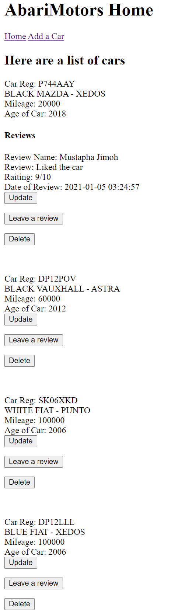

Add a car
This is my create functionality

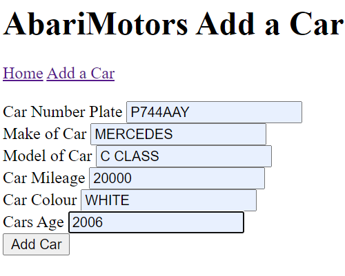

Update a Car
This is my update functionality

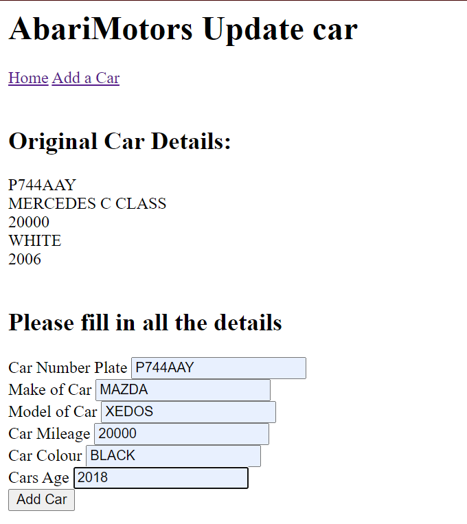

Delete a car
This is my delete functionality

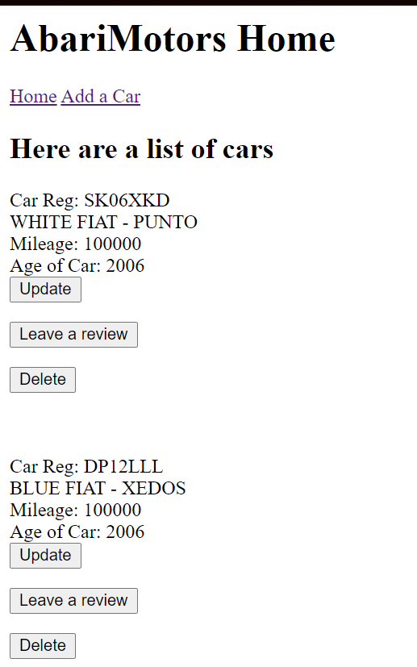

# Known Issues
Currently a user can add a review but they arent able to edit or delete their review, the only way to delete the review is by deleting the car
When leaving a raiting on the car, i added a number validator between 1-10, however i havent put a message there so if the user was to enter 11 nothing will which could give the impression that the website isnt responding

# Future Improvements

	• CSS
	• Allow Reviewers to have accounts
	• Allow Car Owners to have an account
	• Filter by Make, Model, Colour
	Add Pictures

# Author
Mustapha Abari-Jimoh

